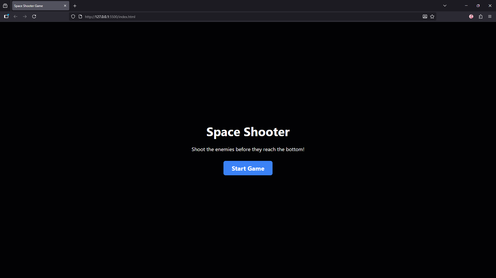
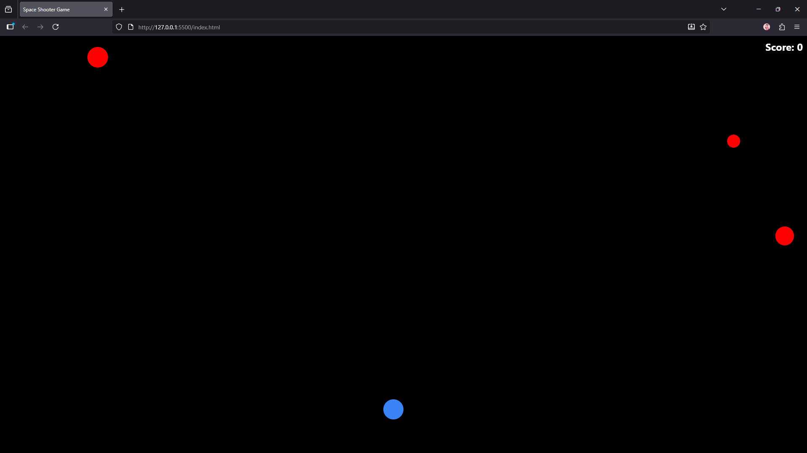
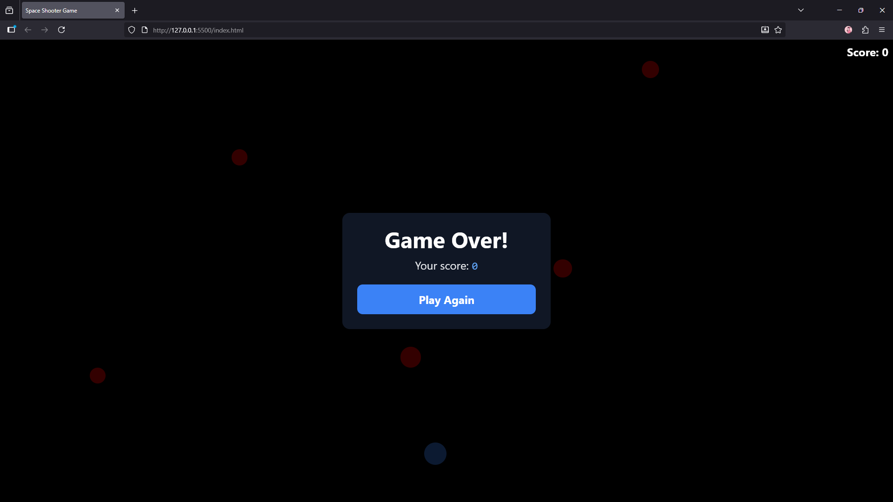
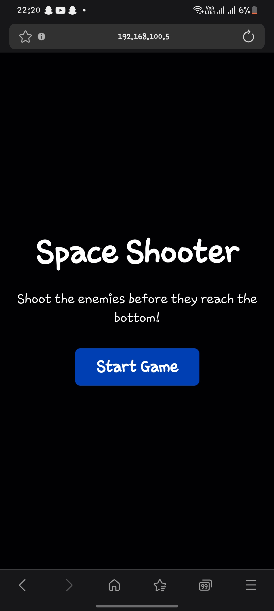
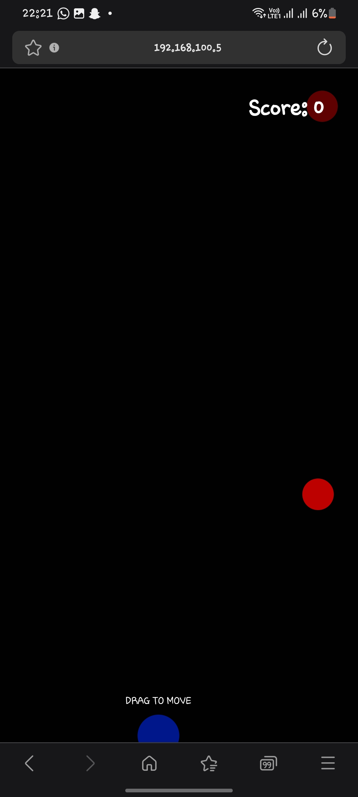
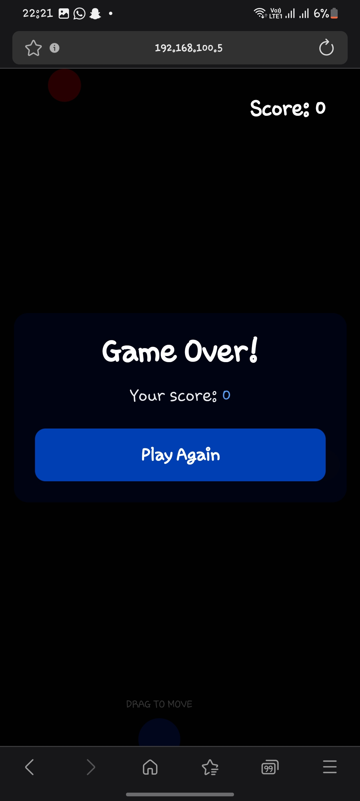

# Shooter Game

A fast-paced, browser-based shooter game built with HTML5 Canvas and vanilla JavaScript. Test your reflexes and aim in this action-packed game!

## Features

- Smooth player movement and shooting mechanics
- Enemy AI with pathfinding
- Score tracking and high scores
- Responsive design for both desktop and mobile
- Sound effects and visual feedback
- Progressive difficulty scaling

## Screenshots

### Desktop View
#### Game Start


#### Game Play


#### Game Over


### Mobile View
#### Game Start


#### Game Play


#### Game Over


## How to Play

### Desktop Controls
- **WASD** or **Arrow Keys**: Move player
- **Mouse Click**: Shoot in the direction of the cursor
- **Space**: Special ability (if implemented)
- **P**: Pause game

### Mobile Controls
- **Touch and drag** on the left side: Move player
- **Touch and drag** on the right side: Aim and shoot
- **Pause button**: Pause game

## Installation

1. Clone the repository:
   ```bash
   git clone https://github.com/yourusername/shooter-game.git
   ```
2. Open `index.html` in your web browser
3. No build step or dependencies required!

## Technologies Used

- HTML5 Canvas
- Vanilla JavaScript (ES6+)
- CSS3 for styling
- Web Audio API for sound effects

## Browser Support

- Chrome (latest)
- Firefox (latest)
- Safari (latest)
- Edge (latest)
- Mobile Safari (iOS 12+)
- Chrome for Android

## Contributing

Contributions are welcome! Please feel free to submit a Pull Request.

## License

This project is licensed under the MIT License - see the [LICENSE](LICENSE) file for details.

## Future Improvements

- [ ] Add power-ups and special abilities
- [ ] Implement different enemy types
- [ ] Add multiple levels
- [ ] Add sound settings
- [ ] Implement player profiles and achievements

## Credits

- Game developed by Griffins Muteheri
